

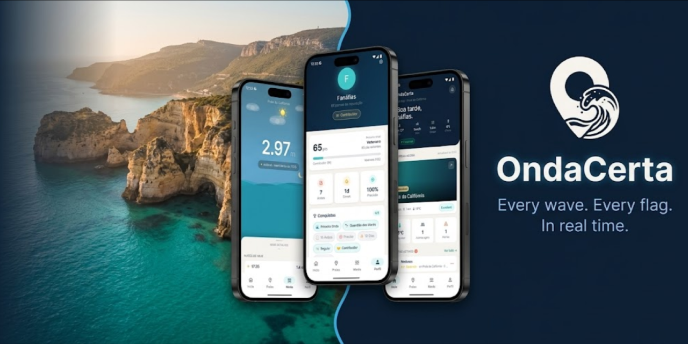

# OndaCerta

**Collaborative platform and real-time bathing data aggregator**

*Final Year Project · BSc in Computer Engineering*
*Escola Superior de Tecnologia de Setúbal, IPS · 2026*

---

## Table of Contents

- [About the project](#about-the-project)
- [Features](#features)
- [Main screens](#main-screens)
- [Architecture](#architecture)
- [Technical documentation](#technical-documentation)
- [Roadmap](#roadmap)
- [Terms of use](#terms-of-use)

---

## About the project

Planning a beach day at Arrábida usually means having at least 3 or 4 tabs open at the same time — one for the weather, another for tides, a third for water quality, and then separately having to figure out the buses, since none of those sources were built to work together or with the average beachgoer in mind.

OndaCerta was built to address that. It aggregates all those data sources into a single app and on top of that adds a community layer, similar in concept to what Waze does for traffic — people physically present at the beach can report conditions, confirm what flag is currently flying and vote on other users' reports. Any write action requires physical presence, verified via GPS heartbeat, so the data stays reasonably accurate.

For now the app only covers Arrábida and Sesimbra. The architecture was designed from the start to scale to other beaches later on, which is part of why some parts of it ended up more complex than strictly necessary for two locations.

---

## Features

### Real-time data
- weather: temperature, wind, precipitation and humidity
- sea conditions (wave height, period, direction)
- tide chart with cosine interpolation, window always centred on the current time
- water quality from EEA (Excelente / Boa / Suficiente / Má)
- next public transport departures grouped by destination, times updated via GPS

### Community layer
- submit alerts with type, severity and a short description
- vote on other user reports (up/down, toggleable)
- confirm or contest the current flag colour (green, yellow, red, purple)
- any write action requires physical presence, verified via GPS heartbeat
- alerts expire automatically once they accumulate enough downvotes

### Profile and gamification
- reputation level and score built from contributions
- beach day streak tracked through the heartbeat, counts once per day
- achievements evaluated in real time
- activity log

### Personal settings
- favourite beaches synced across devices
- push notification settings: alert types, radius, minimum severity and quiet hours
- privacy controls: location accuracy, profile visibility, anonymous sharing
- account deletion, confirmation required and a 30-day data retention period after that

---

## Main screens

### Authentication

<table><tr>

<td align="center" valign="top" width="33%">

**Splash**
wave animation while the session loads in the background.
</td>

<td align="center" valign="top" width="33%">

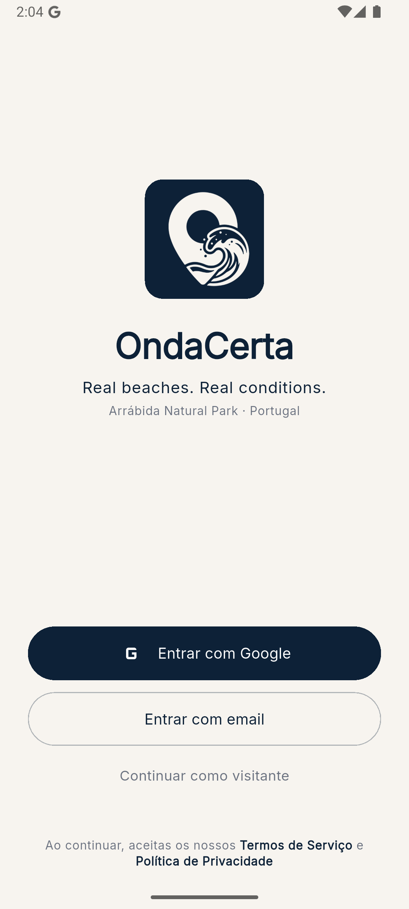

**Login**
google or email/password sign-in, guest access available without registration
</td>

<td align="center" valign="top" width="33%">

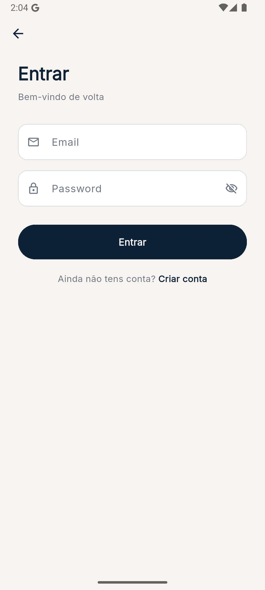

**Email Login**
email and password registration and login
</td>

</tr></table>

---

### Dashboard and Beaches

<table><tr>

<td align="center" valign="top" width="33%">

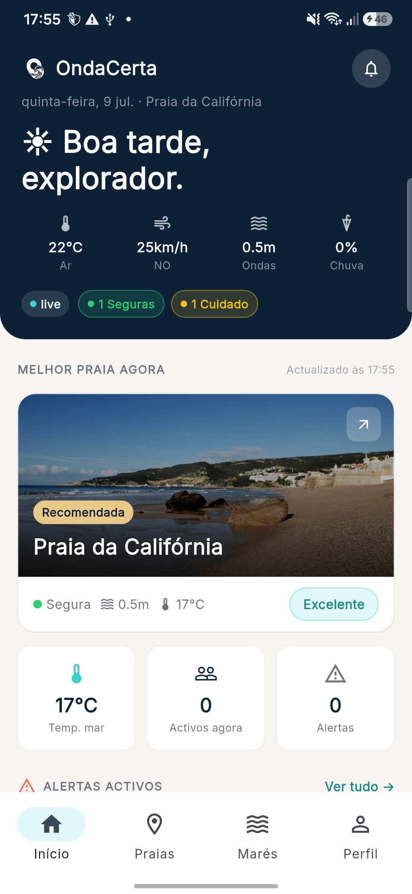

**Dashboard**
closest beach at the top, flag, current conditions, tide chart and active alerts
</td>

<td align="center" valign="top" width="33%">

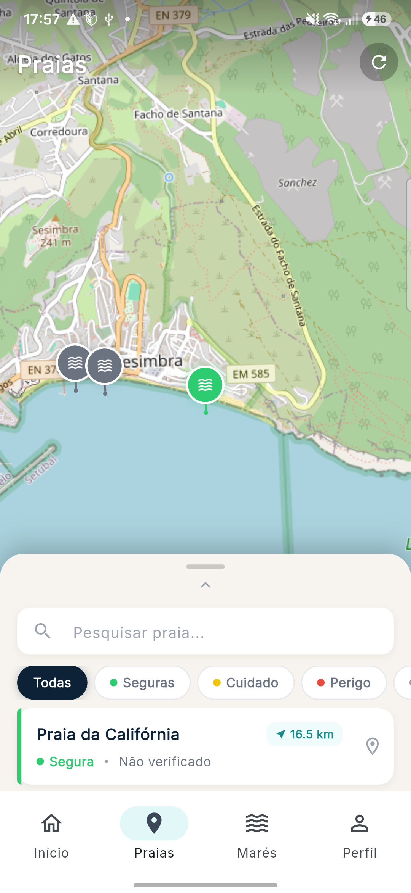

**Beaches**
OpenStreetMap with a sliding panel, search and filter by flag colour
</td>

<td align="center" valign="top" width="33%">

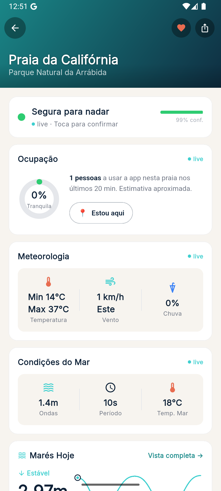

**Beach Detail**
everything for one beach: weather, sea, tides, water quality and also transport and alerts.
</td>

</tr></table>

---

### Community and Flags

<table><tr>

<td align="center" valign="top" width="33%">

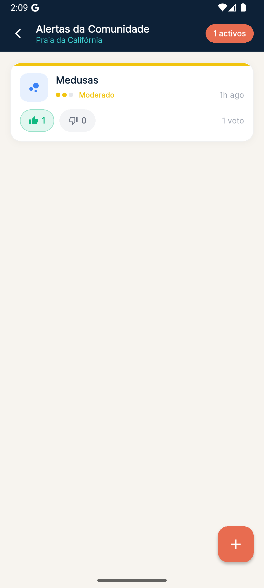

**Alerts**
alert feed with severity, voting and a button to report something new
</td>

<td align="center" valign="top" width="33%">

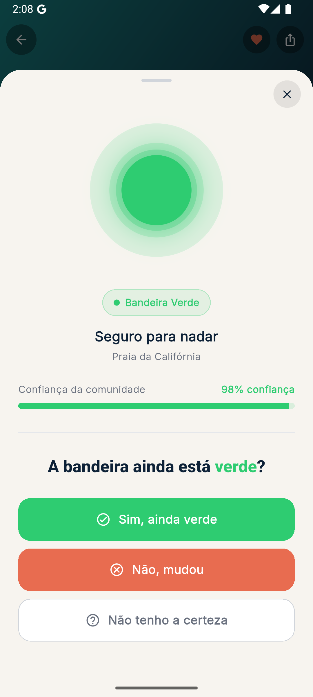

**Confirm Flag**
sheet with sonar animation, confidence score, confirm or contest
</td>

<td align="center" valign="top" width="33%">

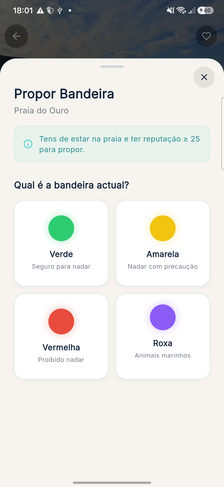

**Propose Flag**
2x2 grid to pick a colour, only unlocks once reputation is high enough
</td>

</tr></table>

---

### Tides, Profile and Favourites

<table><tr>

<td align="center" valign="top" width="33%">

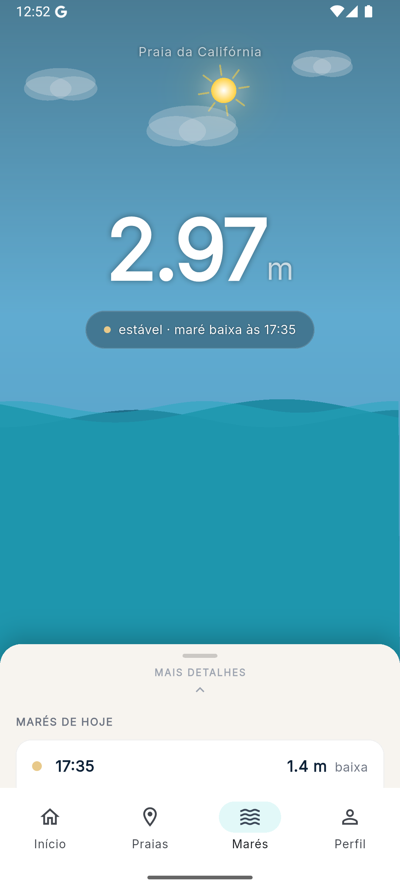

**Tides**
fullscreen tide view with an animated ocean background that changes with the time and weather
</td>

<td align="center" valign="top" width="33%">

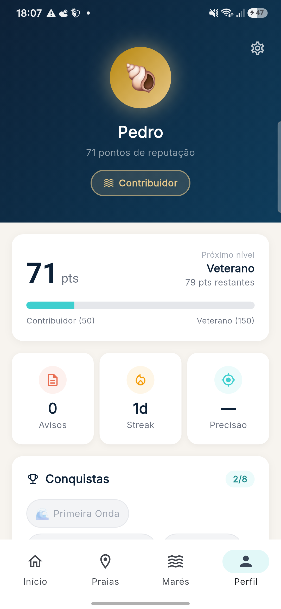

**Profile**
reputation, streak, achievements, contribution stats and recent activity
</td>

<td align="center" valign="top" width="33%">

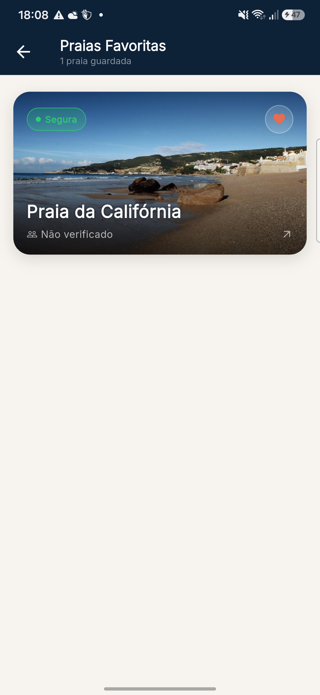

**Favourites**
saved beaches with pull-to-refresh, synced across devices
</td>

</tr></table>

---

### Settings

<table><tr>

<td align="center" valign="top" width="50%">

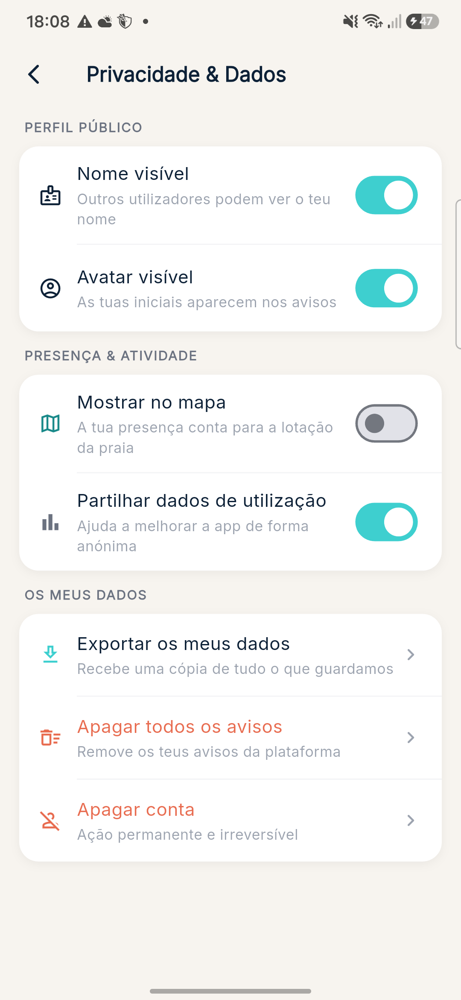

**Privacy**
location accuracy, visibility and data sharing settings and account deletion is down here too
</td>

<td align="center" valign="top" width="50%">

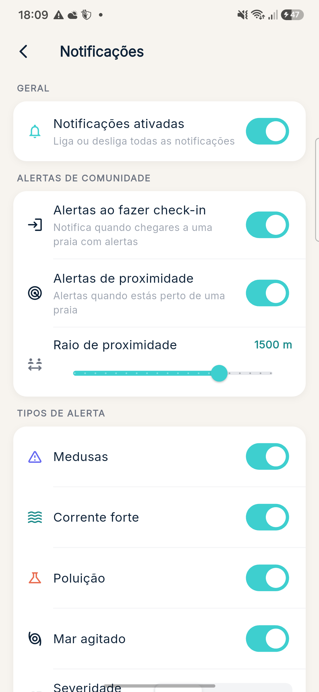

**Notifications**
configure which alerts to receive, proximity radius, minimum severity and quiet hours
</td>

</tr></table>

---

## Architecture

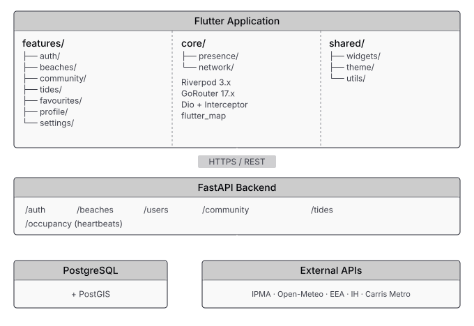

| Layer | Technology | Notes |
|---|---|---|
| Mobile app | Flutter 3.x / Dart 3 | iOS 16+ and Android 10 (API 29+) |
| State management | Riverpod 3.x | AsyncNotifier, optimistic updates |
| Navigation | GoRouter 17.x | Declarative routes, deep linking |
| HTTP | Dio + AuthInterceptor | Silent token renewal |
| Maps | flutter_map + OSM | No paid dependencies |
| Backend | FastAPI (Python) | REST API, background jobs, PostGIS |
| Database | PostgreSQL + PostGIS | Geospatial presence, favourites, achievements |

---

## Technical documentation

Detailed docs for each part live in their respective directories:

| Component | README | Contents |
|---|---|---|
| 📱 **Flutter App** | [`onda_certa_app/README.md`](onda_certa_app/README.md) | Folder structure, dependencies, environment variables, how to run locally |
| ⚙️ **Backend API** | [`backend/README.md`](backend/README.md) | Setup, endpoints, authentication, background jobs, deployment |

---

## Roadmap

### ✅ Completed

**Infrastructure and authentication**
- [x] Feature-first architecture with Riverpod 3.x
- [x] Google auth, email/password and guest mode
- [x] Secure token storage (Keychain / Keystore)
- [x] Silent token renewal with Dio interceptor
- [x] Native splash screen with wave animation

**Screens**
- [x] HomeScreen: dashboard with nearest beach, conditions, tides and alerts
- [x] BeachListScreen: list + interactive OpenStreetMap with sliding panel
- [x] BeachDetailScreen: full detail, pull-to-refresh and auto-refresh via RouteAware
- [x] TideScreen: immersive full-screen view with adaptive oceanic animation
- [x] CommunityAlertsScreen: alerts with optimistic voting and report submission
- [x] ProfileScreen: reputation, streak, achievements and history
- [x] FavouritesScreen: saved beaches with multi-device sync
- [x] PrivacySettingsScreen: location and visibility controls
- [x] NotificationSettingsScreen: 14 push notification parameters

**Community layer**
- [x] Alert submission with presence verification via heartbeat
- [x] Optimistic voting with rollback on server error
- [x] Flag confirmation with sonar animation and animated confidence bar
- [x] Flag proposal (requires reputation >= 5)
- [x] Alerts expire automatically by downvotes

**Gamification and profile**
- [x] Achievement system evaluated in real time
- [x] Presence streak via heartbeat, idempotent per day
- [x] Confirmation rate-limiting: 1 per hour per beach, enforced server-side

**Design system**
- [x] Centralised AppColors, AppSpacing, AppTextStyles
- [x] Flag gradients and colour mappings all in AppColors
- [x] Shared widgets: AlertItem, TideChartPainter, MetricCell, EmptyState
- [x] **TransportPlannerScreen**: a screen to plan how to get to the beach, nearby stop lookup and trip planning
- [x] Display the account deletion time if applicable (login failiture)
- [x] Revert/Cancel account deletion
- [x] Personal data export (the `/users/me/data-export` endpoint already exists in the backend)
- [x] Display auth/register HTTP/1.1" 409 Conflict (on account creation, if happens)
- [x] Improve feedback when doing login with the wrong credentials (or failiture)
- [x] Require a safer password on the regular account creation (currently requires only 8 chars)
- [x] Push notifications (backend)
- [x] Receive notifications (client)
- [x] A user cant have hearthbeats on 2 or more beaches (this gives the effect of being at multiple different places at the same time)
- [x] Require email validation (if not using google account)
- [x] Modify the "im there" button to behave like an "update" hearthbeat
- [x] Update/Reload for the Map page
- [x] Update/Reload for the Tides/Marés page
- [x] Review privacy settings and related features
- [x] Usercount and section on beach detail
- [x] Review the point win/loss features
- [x] Autoban and suspension features completelty working
- [x] Forgot password with code verification
- [x] Change password on current session
- [x] Change email ""
- [x] Change username
- [x] Water quality EEA update year
- [x] Option to choose a profile avatar (pre-defined)
- [x] Images on beaches
- [x] Red flag notification for favorite beaches
- [x] List the users on the beach (respecting the privacy settings) (Now by default this is disabled, but can be enabled by the user)
- [x] Widget/Shortcut for the favorite beaches
- [x] Display current temps (prob requires another api), and remove the "Parque nacional..." for every one
- [x] Disable the interaction with the social/community layer for guests
- [x] Support more than one language (pt and eng)
- [x] Think on a occupation measurement aproach..
---

### 🔜 Planned

- [ ] Review the points system and requirements for certain tasks
- [ ] Consider dealing with favorites as i'm there (receive all nofications)
- [ ] Share button (review feature) (on beach_detail)
- [ ] Final legal pages (Terms of Service, Privacy Policy)

- [ ] Real emails working

- [ ] More tests (specially for the client side)

- [ ] Hosting for the backend

- [ ] Publish
---

### Low priority
- [ ] First use -> app tour

### After the first launch
- [ ] Expand to other Portuguese beaches 

---

Escola Superior de Tecnologia de Setúbal, IPS · 2026

